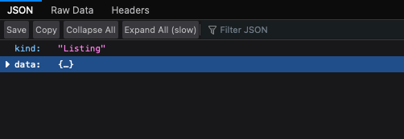
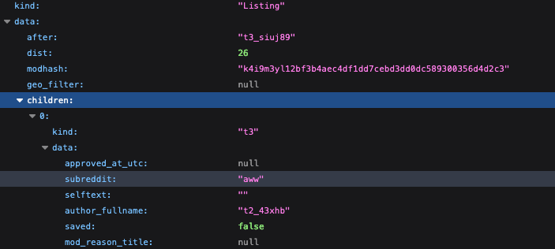

# Argparse Exercise

## Background Information

Reddit maintains an open, JSON based, API for all of its posts, comments, and other things too. Additionally, they are friendly with bots and rate limiting, which makes it a great resource for practicing making web requests, and using APIs. As a result, some of their subreddits even have rules which are designed to make bots easier to design and use. One example is the subreddit "/r/AmITheAsshole".

In this forum users submit their personal stories of interpersonal conflict and ask the internet to judge them. Stories range from surprisingly wholesome to shockingly horrible. Users are asked to vote via comment, and the possible votes are...

* YTA: "You're The Asshole"
* NTA: "Not The Asshole"
* ESH: "Everyone Sucks Here"
* NAH: "No Assholes Here"

If users wish to make a judgement, they are asked to use one (and only one) of these acronyms (in all caps) in their comment.

## Exercise Description

You have been provided with a script that does the following:

* Fetches the top posts of the day from reddit.com/r/amITheAsshole
* For each post:
    * Look at the top default number of comments (default set by Reddit)
    * Tally up the votes in those comments.
    * Display a summary of the situation and the votes.
    * Save that summary to a file.

This script is deterministic and completely unconfigurable. Your goal is to take the existing code and make it more useful by providing options via `argparse`. Specifically, allow a user to specify:

* A maximum number of posts to consider.
* A maximum number of comments to consider.
* The name of the output folder for the summaries.
* A threshold for each vote (YTA, NTA, ESH, NAH) compared to the number of posts required to save the post to a file
    * e.g. YTA=0.25 means a post should only be saved if at least 25% of the comments voted "YTA"
    * e.g. NTA=0.6 means a post should only be saved if at least 60% of the comments voted "NTA"

## Documentation and Other Helpful Resources

### Python Resources

* [Argparse Documentation](https://docs.python.org/3/library/argparse.html)
* [Requests Documentation](https://requests.readthedocs.io/en/latest/)

Reddit provides this data in a textual format called JavaScript Object Format (JSON). This format is ubiquitous on the web for a variety of reasons. The script uses `requests` to parse this JSON formatted data into a deeply nested Python dictionary, you may still want to read this [overview of using the JSON format in Python](https://realpython.com/python-json/).

### Reddit Resources

Reddit's JSON format is "well structured" which means it always follows a consistent set of rules. Many of these rules are documented on [Reddit's API documentation](https://www.reddit.com/dev/api) with additional information about the JSON structure on this [Reddit Wiki page](https://github.com/reddit-archive/reddit/wiki/JSON).

This data can be fetched from any subreddit by adding .json to the end of the usual URL. For example, for the current top 20 posts on /r/awww in json simply go to [https://www.reddit.com/r/AmItheAsshole.json](https://www.reddit.com/r/AmItheAsshole.json).

It can be extremely helpful to look at this data in program designed to navigate JSON. Firefox has an excellent JSON navigator built in, so if you open the JSON URL in Firefox you'll see something like this:

If you click on one of the arrows next to a field whose data is also a collection (either a dictionary or list) it will expand.

This popular Chrome extension provides similar functionality in Chrome [https://chrome.google.com/webstore/detail/json-viewer/gbmdgpbipfallnflgajpaliibnhdgobh](https://chrome.google.com/webstore/detail/json-viewer/gbmdgpbipfallnflgajpaliibnhdgobh). 

If you don't want to install Firefox or this Chrome extension, this online tool provides similar functionality: [https://codebeautify.org/jsonviewer](https://codebeautify.org/jsonviewer).

### Rate Limiting

Reddit does rate limit bot requests. Make sure you specify a User-Agent header because Reddit will significantly increase the amount of requests you can make in a given unit time if you include a User-Agent.

Additionally, you may want to start by only processing the comments of the top 1 posts. Once that code works, expand to more posts. This way you'll reduce your chance of getting rate limited while your code still has significant errors.